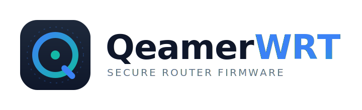

<div align="center">



<br/>

[](LICENSE)
[]()
[]()
[]()

**A hardened, custom-branded router firmware for the RT-AC87U.**  
Updated security stack · strict firewall · encrypted DNS · custom branding.

</div>

---

## What is QeamerWRT?

QeamerWRT is a personal firmware project built on top of **Asuswrt-Merlin 384.13_10** — the last community-maintained release for the RT-AC87U. The router reached end-of-life in 2020, but its userspace security components (TLS, DNS, SSH) can be modernised through careful backporting.

**Owner / maintainer:** Kent "Qeamer" Nygjerdet  
**Target hardware:** RT-AC87U · BCM4709 · ARMv7 32-bit · separate Quantenna 5 GHz radio

### It is
- Updated internet-facing components: TLS / DNS / SSH / curl
- Closed attack surface: no WAN admin, no UPnP, no WPS
- Strict firewall with IPSet blocklists and DDoS mitigation
- Encrypted DNS (DNS-over-TLS + DNSSEC)
- QeamerWRT branding baked into UI, login page and SSH banner

### It is not
- A new kernel — the closed Broadcom `wl.ko` driver locks the kernel version
- WPA3 — requires driver support that cannot be added
- A fix for the Quantenna 5 GHz radio — closed firmware, no source available
- A replacement for a supported 2025+ router on the WAN edge long-term

---

## Security improvements

| Component | From | To | CVEs closed |
|-----------|------|----|-------------|
| **dnsmasq** | 2.81 | ≥ 2.90 | CVE-2020-25681…25687 (DNSpooq) |
| **OpenSSL** | 1.0.2u (EOL) | 1.1.1w | CVE-2022-0778, CVE-2021-3711, CVE-2021-3712, CVE-2023-0286 |
| **Dropbear** | 2020.80 | ≥ 2022.83 | CVE-2021-36369 + hardened cipher list |
| **curl** | ~7.66 | 8.x | Dozens of URL/TLS CVEs (2020–2026) |
| **BusyBox** | old | newer stable | CVE-2021-42373…42386, CVE-2022-28391 |
| **nettle** | old | 3.10.x | CVE-2021-3580 |
| **zlib** | old | ≥ 1.2.12 | CVE-2022-37434 |
| **CA bundle** | stale | fresh Mozilla bundle | Removes expired/revoked root CAs |

**Firewall / DNS hardening baked in:**
- Default-drop on all unsolicited WAN traffic
- SYN cookies, rp_filter, anti-bogon, rate-limited ICMP
- DNS-over-TLS (stubby → Quad9), DNSSEC validation, DNS rebind protection
- IPSet blocklists (botnets, scanners, malicious IPs) loaded at boot

---

## Phase plan

| Phase | Deliverable | Brick risk |
|-------|-------------|------------|
| **0** | Add-on hardening on stock firmware (Skynet, Diversion, stubby via `amtm`) — do this tonight | None |
| **1** | Build environment + unmodified image that compiles and boots | Low–medium |
| **2** | QeamerWRT branding + UI theme baked into image | Low |
| **3** | Firewall + DDoS + DNS hardening baked in | Medium |
| **4** | Backport TLS / DNS / SSH / curl userspace components | Medium |
| **5** | Freeze QeamerWRT 1.0, publish GPL source | — |

> **Start with Phase 0.** It delivers ~80% of the security benefit tonight, with zero brick risk, on the firmware you already have. Build Phase 1+ as the ownership/hobby project alongside it.

---

## Quick start — Phase 0 (stock firmware, no build needed)

SSH into the router and run:

```bash
# Install amtm (if not present)
curl -Os https://raw.githubusercontent.com/decoderman/amtm/master/amtm
sh amtm

# From the amtm menu install:
# sk  →  Skynet   (IPSet firewall + DDoS + blocklists)
# di  →  Diversion (DNS ad/malware blocking)
# st  →  stubby    (DNS-over-TLS)
```

Then in the router web UI:
- Administration → System → Disable Telnet, enable HTTPS-only
- WAN → Disable UPnP, NAT-PMP
- Wireless → Disable WPS
- Administration → System → Disable "Enable web access from WAN"

---

## Quick start — Phase 1 (build environment)

See [`guides/phase1-build.md`](guides/phase1-build.md) for the full walkthrough. Short version:

```bash
# Ubuntu 18.04/20.04 VM recommended
git clone https://github.com/RMerl/asuswrt-merlin.git
cd asuswrt-merlin
git checkout 384.13

sudo apt install -y build-essential libtool-bin autoconf automake \
  bison flex g++ gawk gengetopt gettext git gperf nano \
  libncurses5-dev libssl-dev zlib1g-dev unzip uuid-dev xsltproc cmake

cd release/src-rt-6.x.4708
make rt-ac87u 2>&1 | tee ~/build-ac87u.log
```

> ⚠️ Flash nothing until you have a USB-TTL serial cable connected and CFE/TFTP recovery tested. Read the fase 1 document fully first.

---

## Documents — read in this order

| # | Document | What it covers |
|---|----------|---------------|
| 1 | [`docs/roadmap.md`](docs/roadmap.md) | Overall plan, two tracks (add-on vs. custom build), phases, recovery |
| 2 | [`docs/security/threats.md`](docs/security/threats.md) | What actually attacks home routers |
| 3 | [`docs/security/risk-assessment.md`](docs/security/risk-assessment.md) | Risk assessment, likelihood, residual risk |
| 4 | [`docs/security/policy.md`](docs/security/policy.md) | The security standard this project follows |
| 5 | [`docs/backport-targets.md`](docs/backport-targets.md) | Component list, target versions, CVEs closed |
| 6 | [`guides/phase0-hardening.md`](guides/phase0-hardening.md) | **Phase 0:** step-by-step add-on hardening checklist (no build needed) |
| 7 | [`guides/phase1-build.md`](guides/phase1-build.md) | Phase 1: build the first unmodified image |
| 8 | [`branding/README.md`](branding/README.md) | How to bake the logo and name into the UI |
| 9 | [`ui-theme/`](ui-theme/) | QeamerWRT visual theme for the web interface |

---

## Repository layout

```
QeamerWRT/
├── README.md          ← you are here
├── INDEX.md           ← full project map
├── AGENTS.md          ← AI assistant constraints (read before letting AI edit)
├── CONTRIBUTING.md    ← how to contribute
├── NOTICE.md          ← upstream copyright attributions (GPL required)
├── LICENSE            ← GPL-2.0-only
├── CHANGELOG.md       ← version history
├── assets/logo/
│   ├── qeamerwrt_logo.svg
│   └── qeamerwrt_logo_dark.svg
├── docs/
│   ├── roadmap.md
│   ├── backport-targets.md
│   ├── cursor-prompt.md
│   └── security/
│       ├── threats.md
│       ├── risk-assessment.md
│       └── policy.md
├── guides/
│   ├── phase0-hardening.md
│   └── phase1-build.md
├── branding/
│   ├── README.md
│   └── branding.css
├── ui-theme/
│   ├── theme.css
│   ├── preview.html
│   └── preview.svg
└── .github/
    ├── pull_request_template.md
    └── ISSUE_TEMPLATE/
        ├── bug_report.md
        └── backport_request.md
```

---

## Contributing

See [`CONTRIBUTING.md`](CONTRIBUTING.md). The short version:

1. Upstream copyright and license notices are **never** removed — this is a GPL requirement.
2. No binary blobs; source + patches only.
3. No changes to the Broadcom kernel or Quantenna radio.
4. Test on hardware before submitting; include before/after version strings.

Upstream attributions (ASUS / ASUSTeK, Asuswrt-Merlin / Eric Sauvageau, Linux kernel, GNU components) are documented in [`NOTICE.md`](NOTICE.md).

---

## License

**GPL-2.0-only.** This project is a fork of GPL-licensed upstream code.  
The upstream copyright and license notices in the source tree are preserved as the licence requires.  
If you distribute modified binaries, you must publish your source changes.

See [`LICENSE`](LICENSE) for the full text.

---

## Disclaimer

QeamerWRT is an independent, non-commercial hobby project. It is **not affiliated
with, sponsored by, or endorsed by** ASUSTeK Computer Inc. (ASUS), the
Asuswrt-Merlin project, or any other third party. Product names, trademarks, and
logos of those parties belong to their respective owners and are used here only
to describe the hardware and upstream code this project is based on (nominative
use). Upstream copyright and license notices are preserved in full — see
[`NOTICE.md`](NOTICE.md). Use at your own risk; no warranty.
